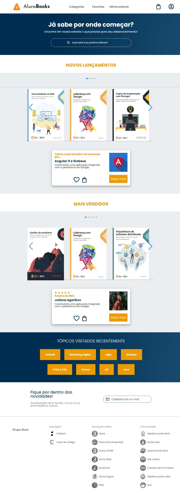

# Alura Books

Site desenvolvido como parte do curso de Responsividade com Mobile First em HTML e CSS da Alura.

## 🔨 Funcionalidades e objetivos do projeto

O AluraBooks possui uma estrutura bem simples composta por uma página única com algumas sessões que simulam um site real. O desenvolvimento desse projeto teve como principal objetivo ampliar os conhecimentos básicos de front-end, como flexbox, pseudo-classes, pseudo-elementos, carrossel com SwiperJS, media queries, etc.

## ✔️ Técnicas e tecnologias utilizadas

As técnicas e tecnologias utilizadas pra isso são:

- `Flexbox`: estrutura para cogenizar a página em conteiners
- `Fontes personalizadas`: configuração para adicionar novas fontes
- `Classes`: tecnologia utilizada apra abribuir formatação css aos elementos do html
- `Pseudo-classes`: palavra-chave adicionadas a seletores que especifica um estado especial do elemento selecionado
- `pseudo-elementos`: palavras-chave adicionadas a seletores que permite a estilização de uma parte específica do elemento selecionado 
- `media queries`: utilziada para ajudar a dar responsividade ao site
- `SwiperJS`: tecnologia moderna open source de carrossel, para transição de slides em dispositivos mobile

## 📱 Vislumbre geral da página

## Feito por:

### Gabriel Luiz
